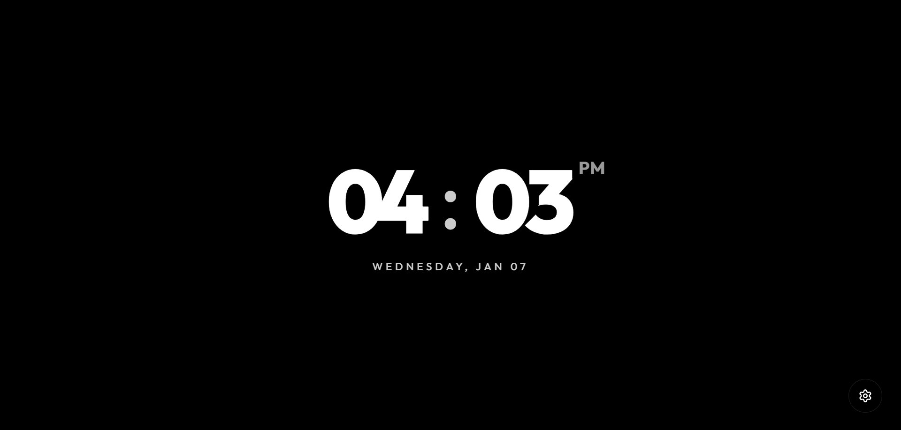
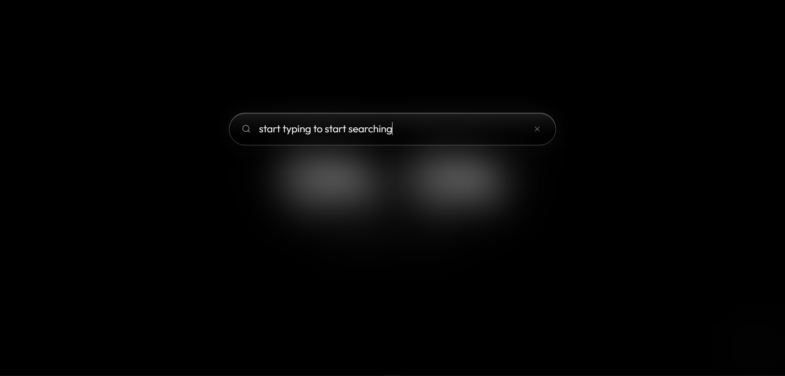
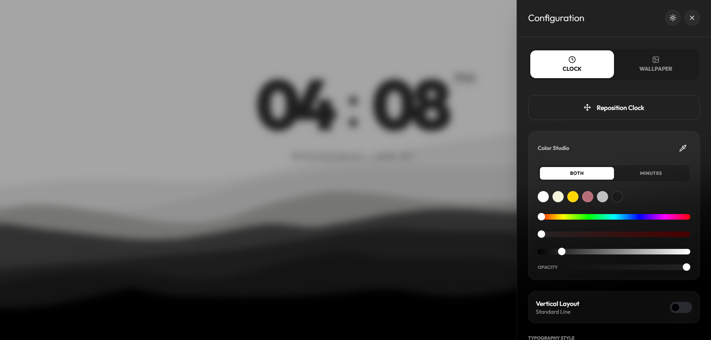
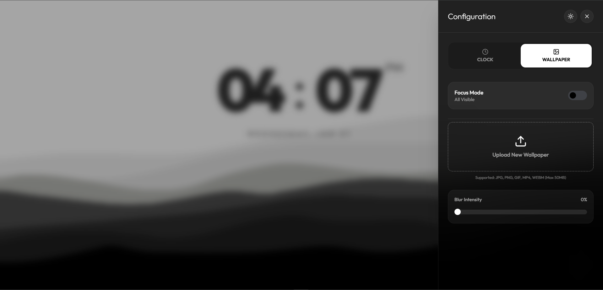
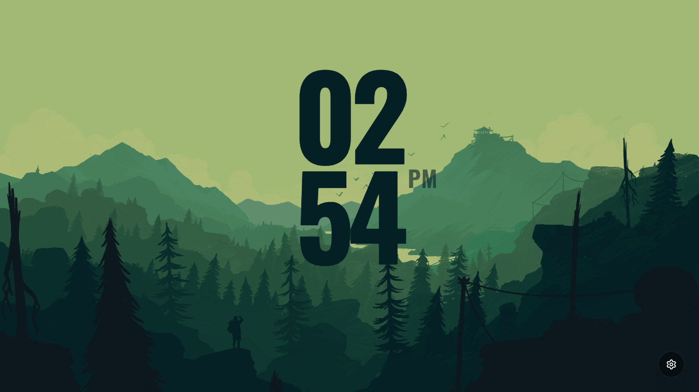
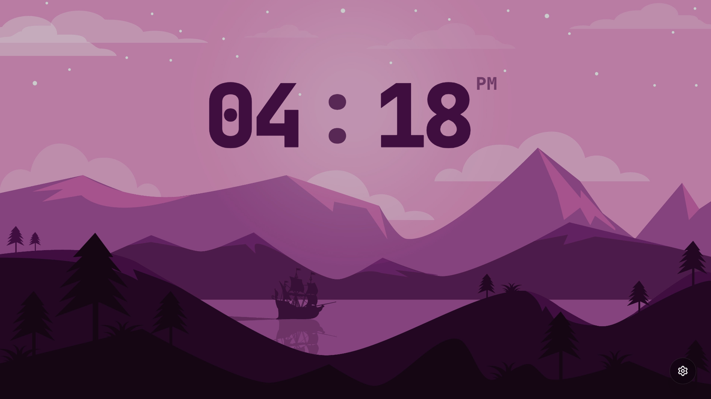

# Tabee

A minimal, customizable **New Tab browser extension** focused on calm visuals, fast search, and distraction-free design.

This project replaces the default new tab page with a clean interface centered around time, focus, and personal aesthetics.

---

## 📸 Screenshots

### Default New Tab
Clean and minimal view with the clock as the main focus.

---

### Instant Search
Start typing anywhere to search. No buttons, no clicks.

---

### Clock Customization
Font selection, layout options, and wireframe styles.

---

### custom wallpaper
any form of images and videos can be used as wallpapers.
jpeg,png,mp4,....

---

### others
below screenshots shows customized new tabs with this extension

---

## ✨ Features

- **Instant Search**
  - Start typing anywhere to search
  - No buttons, no clicks

- **Custom Clock**
  - Multiple font options
  - Horizontal and vertical layouts
  - Outline (wireframe) and solid styles
  - Optional day, date, and AM/PM display

- **Color Control**
  - Single color by default (applies to everything)
  - Optional minute accent color
  - One color picker with context-based editing
  - Day, date, and AM/PM always follow hours color

- **Focus Mode**
  - Removes wallpaper
  - Black & white minimal view
  - Displays only the clock
  - Designed for distraction-free sessions

- **Wallpaper Support**
  - Static images
  - Live wallpapers (MP4 / WEBM)
  - Blur and opacity controls

- **Performance Friendly**
  - Minimal UI
  - No unnecessary widgets
  - Lightweight by design

---

## 🧠 Design Philosophy

- Defaults should look good without customization
- Customization should be optional
- No visual clutter
- Keyboard-first interaction
- Calm over productivity noise

---

## 🛠️ Tech Stack

- **React**
- **Vite (v4)**
- **Tailwind CSS**
- JavaScript
- HTML5
- Browser Extension APIs

---

